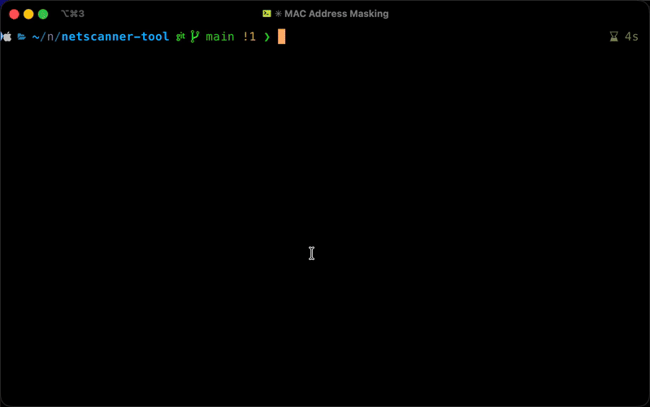

# Network Scanner

A modern, async Python network scanner for macOS that discovers devices on your local network and identifies their open ports.

<div align="center">


</div>

## Features

- ARP table scanning for device discovery
- Async port scanning with nmap
- MAC vendor lookup via API
- Beautiful terminal UI with Rich
- Configurable ports and concurrency

## Demo



## Quick Start

```bash
git clone https://github.com/Aayush9029/netscanner-tool.git
cd netscanner-tool
uv pip install -e .
uv run netscanner
```

## Requirements

- macOS 15.1+
- Python 3.12+
- nmap: `brew install nmap`

## Installation

```bash
# Install uv
curl -LsSf https://astral.sh/uv/install.sh | sh

# Install package
git clone https://github.com/Aayush9029/netscanner-tool.git
cd netscanner-tool
uv pip install -e .
```

## Usage

**Basic scan:**
```bash
netscanner
```

**Custom ports:**
```bash
netscanner --ports 22,80,443
```

**Adjust concurrency:**
```bash
netscanner --max-concurrent 10
```

**Help:**
```bash
netscanner --help
```

## Default Ports

By default, netscanner uses nmap's top 1000 most commonly scanned ports for comprehensive coverage.

## License

MIT License - see [LICENSE](LICENSE) file.
